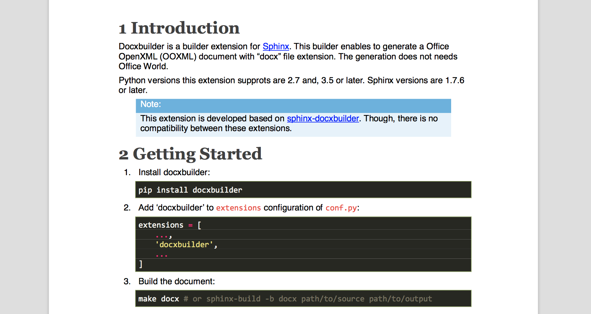

Introduction
============

Docxbuilder is a builder extension for `Sphinx`_.
This builder enables to generate a Office OpenXML (OOXML) document with "docx" file extension.
The generation does not needs Office World.

Python versions this extension supprots are 2.7 and, 3.5 or later.
Sphinx versions are 1.7.6 or later.

.. note::

   This extension is developed based on `sphinx-docxbuilder`_.
   Though, there is no compatibility between these extensions.

.. _`Sphinx`: http://www.sphinx-doc.org/en/master/
.. _`sphinx-docxbuilder`: https://bitbucket.org/haraisao/sphinx-docxbuilder/

Getting Started
===============

#. Install docxbuilder::

     pip install docxbuilder

   If you use the math directive in your document, you should install also extra packages::

     pip install docxbuilder[math]

#. Add 'docxbuilder' to ``extensions`` configuration of ``conf.py``::

     extensions = [
         ...,
         'docxbuilder',
         ...
     ]

#. Build the document::

     make docx # or sphinx-build -b docx path/to/source path/to/output

Usage
=====

Docxbuilder defines the below configurations to specify the style file or to
customize the docx document properties.

**docx_documents**
  This value determines how to group the document tree into docx files.
  It must be a list of tuples ``(startdocname, targetname, docproperties, toctree_only)``,
  where the items are:

  *startdocname*
    A string, that is the document name of the docx file master document.
  *targetname*
    A string, that is the file name of the docx file.
  *docproperties*
    A dictionary from a string to a value, that specified the document property.
    The detail is described on :doc:`docprops`.
  *toctree_only*
    If true, the contents of the *startdocname* document is not included in the
    output except the TOC tree.

**docx_style**
  The path to the style file.
  Relative path is taken as relative to the directory including ``conf.py``.
  If set to the empty string, default style files is used.
  Default: empty.
**docx_coverpage**
  If true, a cover page is inserted as the first page from the style file.
  If no cover page is found on the style file, no cover page is inserted.
  Default: ``True``.
**docx_pagebreak_before_section**
  The maximum section level, which a page break is inserted before sections with
  a level is less or equal to. Default: ``0`` (The level of top sections is 1,
  then no page break is inserted).
**docx_pagebreak_before_file**
  The maximum section level, which a page break is inserted before the first
  contents of each file in section level less than or equal to.
**docx_pagebreak_before_table_of_contents**
  The maximum section level, which a page break is inserted before each table of contents in section level less than or equal to.
  Default: ``-1`` (No page break is inserted).
**docx_pagebreak_after_table_of_contents**
  The maximum section level, which a page break is inserted after each table of
  contents in section level less than or equal to.
  Table of contents are inserted on the place corresponding to non-hidden toctrees.
  Default: ``0`` (Page breaks are inserted after the tables before the first section).
**docx_update_fields**
  If true, Office Word will ask to update fields in generated documents when the document is opened.
  This is useful when generated documents references some document properties.
  Default: ``False``.
**docx_table_options**
  A dictionary with table layout options.
  The following options are supported.
  These options enable to be overridden by each table options
  (see :ref:`class_based_customization_section`).

  *landscape_columns*
    The minimum number of table columns, which tables with the number of
    columns more than or equal to are allocated on landscape pages.
    If this number is ``0``, no tables are allocated on landscape pages.
    Default: ``0``.
  *in_single_page*
    If true, each table is arranged so as not to be divided into multiple pages as much as possible.
    Default: ``False``.
  *row_splittable*
    If false, a row **shall not** be arranged in multiple pages.
    Default: ``True``.
  *header_in_all_page*
    If true, table headers will be displayed on each page which the table is arranged in.
    If a table has no headers, this option is ignored.
    Default: ``False``.
**docx_style_names**
  A dictionary from a reStructuredText class name to a docx style name.
  The styles will be applied to characters or tables with the corresponding class names.
  The detail is described on :ref:`user_defined_styles_section`.
  Default:: empty.

These configurations can be added to ``conf.py``::

  docx_documents = [
      ('index', 'docxbuilder.docx', {
           'title': 'Docxbuilder documentation',
           'created': 'author'
           'subject': 'Sphinx builder extension',
           'keywords': ['sphinx']
       }, True),
  ]
  docx_style = 'path/to/custom_style.docx'
  docx_pagebreak_before_section = 1

Notes
=====

If the title of a rubiric directive is "Footnotes", Docxbuilder ignores the title as the latex write does
(see `sphinx documents`_).

.. _`sphinx documents`: http://www.sphinx-doc.org/en/master/usage/restructuredtext/directives.html#directive-rubric

TODO
====

* Support URL path for image path.
* Support image vertical alignment options.

