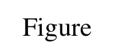

==========
About This
==========

This is a file to define document styles. These styles are applied to documents
generated by *docxbuilder* (This file is also generated by *docxbuilder*).
If you want to use other styles, please modify or replace this file.

*docxbuilder* does not use the contents of the style file, but uses the styles
and page settings.

======
Styles
======

*Heading Styles*
================

=========
Heading 1
=========

Heading 2
=========

Heading 3
---------

Heading 4
*********

Heading 5
~~~~~~~~~

.. rubric:: Rubric Title Heading

.. _link:

*Character Styles*
==================

* *Emphasis*
* **Strong**
* ``Literal``
* :ref:`Hyperlink <link>`
* :sup:`Superscript`
* :sub:`Subscript`
* :title:`Title Reference`
* :abbr:`Abbreviation`

*List Styles*
=============

1. List Number

* List Bullet

  * nested item

    * nested nested item

*Paragraph Styles*
==================

Body Text

Definition Term
   Definition

.. code-block:: guess
   :caption: Literal Caption

   Literal Block

   Image Caption

   Legend

Footnote Reference [#FootnoteReference]_

.. rubric:: Transition

_________

.. [CT] Bibliography
.. [#FootnoteReference] Footnote Text

*Table Styles*
==============

.. rubric:: Table

.. list-table:: Table Caption
   :header-rows: 1
   :stub-columns: 1
   :align: center

   * - Heading1
     - Heading2
     - Heading3
     - Heading4
   * - Cell1-1
     - Cell1-2
     - Cell1-3
     - Cell1-4
   * - Cell2-1
     - Cell2-2
     - Cell2-3
     - Cell2-4
   * - Cell3-1
     - Cell3-2
     - Cell3-3
     - Cell3-4

.. rubric:: Admonitions

.. note:: Admonition Note

.. warning:: Admonition Warning

.. rubric:: Field List

:field1: descirption1
:field2: descirption2

.. rubric:: Option List

--option1   descriptions of option1
--option2   descriptions of option2

*TOC Styles*
============

See :ref:`table of contents <toccontents>`.
